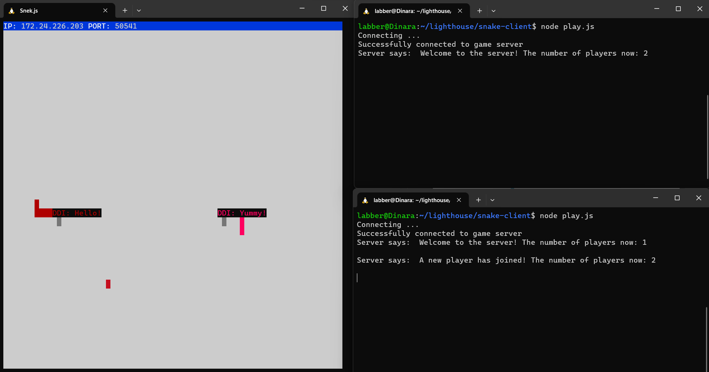
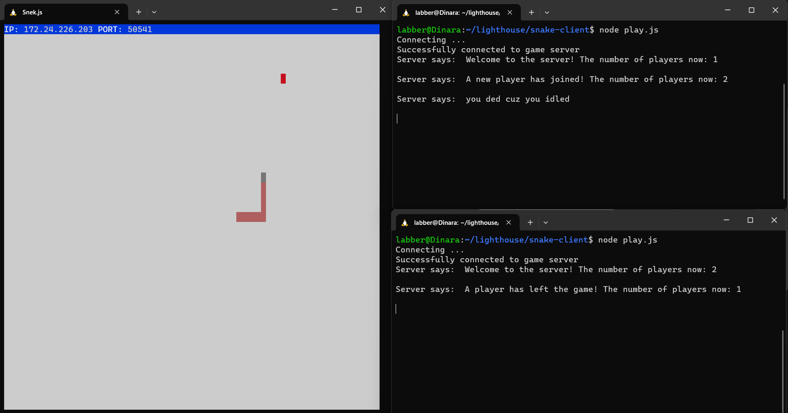

# Snake Client Project

Snake game is a very popular video game. It is a video game concept where the player maneuvers a dot and grows it by ‘eating’ pieces of food. As it moves and eats, it grows and the growing snake becomes an obstacle to smooth maneuvers. The goal is to grow it to become as big as possible without bumping into the side walls, or bumping into itself, upon which it dies.

This is simply a multiplayer take on the genre.

Before you can run this client, you will need to be running the server side which you can download and install from [here](https://github.com/D-Dinara/snek-multiplayer/)

## Functionality Developed:
* Client Setup:	setup server and client and established connection
between the two. Added an event handler to the client that logs "Successfully connected to game server" when a connection is established.
* Connection Module: created a client.js file - used a separate module
to establish the connection.
* Snake initials: The client sends the string "Name: DDI" to the server upon connection. 
* Stdin Setup:	Added function setupInput to play.js with stdin
configuration code. Created a function handleUserInput and registered it as the "data" callback handler for stdin.
* Input Module:	Created an input.js file that acts as a separate module
to handle user input; 
* WASD Movement:	Bound the w, a, s, and d keys to be the up, left, down, right movement keys and let them send messages to the server for the respective movements.
* Sending Messages: Implemented special keys that send canned messages to the server for everyone to see:
  * when "h" is pressed, the client sends "Hello!" to the server;
  * when "o" is pressed, the client sends "Oops!" to the server;
  * when "b" is pressed, the client sends "Buy!" to the server;
  * when "y" is pressed, the client sends "Yummy!" to the server;
* Constants Module: Created a separate file constants.js that exports all the constants used for the app.
* Broadcasting to every client:	
  * Created a new feature that sends a message to every client when a new user joins, including information about the current number of players in the game;
  * Created a new feature that sends a message to every client when a  user leaves the game, providing information about the current number of players in the game;
* Welcome message: Created a new feature that sends a welcome message to the new player when a connection is established, including information about the current number of players in the game.

## Final Product

## Getting Started

- Follow steps inside the snek server repo to run the server side
- Run the development snake client using the `node play.js` command.